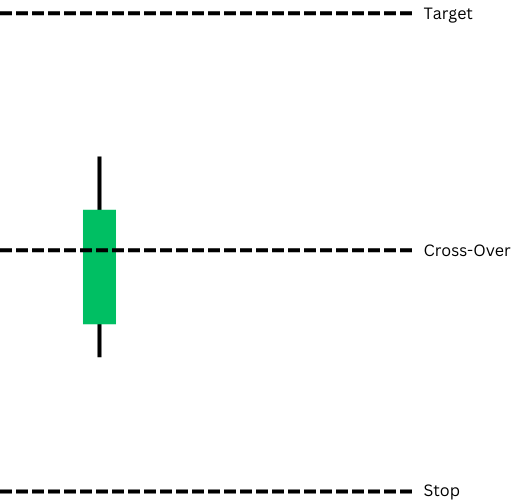
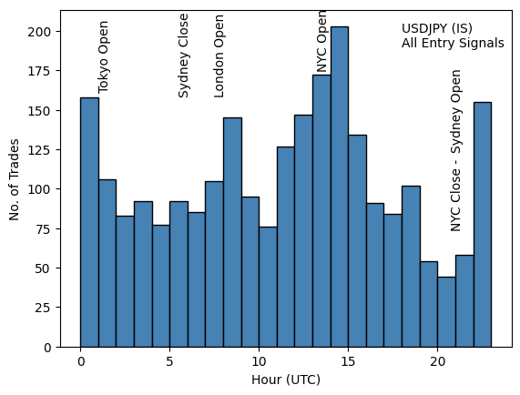

# Redemption_Trader
Algo trading simulation and trading code base

---
### Overview
Brief overvew of the main components built here to develop algorithmic trading strategies.

### Infrastructure
- **Strategy objects** :white_check_mark:
- **simulation enviroment** :white_check_mark:
- **Data pull and pre-processing** :white_check_mark:
- Live trading enviroment :red_circle:

The overall approach was to build strategy objects that behaved in the same manner whether they were being tested in a simulation (backtest) capacity, or in a live trading enviroment. To that end, dynamically asigned classes are created, inheriting an order managemnt system, a data subscription object, and the individaul strategy (`Pipband`) itself with a custom `__init__` function. e.g. For more details on using the `type()` function wiht 3 inputs read here

e.g.

`strat = type('pipband', (sim_env.SimOrderMgmtSystem,sim_env.SimDataSubscription,pipband.Pipband),{'__init__':sim_init})`

Once a strategey is fully developed, the same strat class can be used to instantiate a live trading version of the same strategy using a live trading enviroment with mirrored functionality to the simualtion enviroment i.e. `Live_OMS`, `Live_data_subscription`

`strat = type('pipband', (Live_env.SimOrderMgmtSystem,Live_env.LiveDataSubscription,pipband.Pipband),{'__init__':Live_init})`

This allows seamless migration from development (simulation) to live trading - assuming the parent classes have been built with mirrored method names and attributes. 

### Pipband Strategy
**Basic Thesis**

Around market opens it is believed that prices move more predictably close to whole numbers e.g. 128.0000 adn especially around market opens and closes when trading activity picks up. This 'law of round numbers' or perhaps 'lore of round numbers' could be attributed to traders being more likely to fill orders around price levels that are easier to type-in, or perform mental aritmetic with. Perhaps structured products with FX options bundled together cold also trigger at convenient price levels. The pipband strategy aims to exploit these daily patterns - if they exist. 

USDJPY was taken as a starting point. The BoJ is the largest holder of US Treasuries and the associated FX hedging is theorised to produce repeating patterns in USDJPY price movements. (https://www.statista.com/chart/31941/largest-foreign-holders-of-us-treasury-bonds/)

**Entry Signals**

A simple cross-over of any 5 minute candle with an integer price level is taken as an entry signal. If price moves from below to close above an integer value, that is a long entry. If price moves from above to close below an integer value that is a short entry. 

The next higher(lower) integer value is taken as the target exit for Long (short) positions respectively, wiht the lower (higher) integer levels being taken as the stop loss level.

E.g.

These simple trading rules, which allow for mulitple positions to be open at once, are designed to capture all possible trades over the In-Sample dataset: USDJPY(IS) Apr 2022 - May 2023. 

A constant position size of 1 was used for all trades, in order to calculate PnL. 

Essentially, it worth analysing whether any statistal edge appears or not, before refining trading rules or modelling price movements. Is there any evidence that price movement in the FX market aren't random around market open/close and round numbers?

**All Entry Signals (IS)**

Perhaps as evidence in the origianl thesis, spikes in the frequency in entry signals are seen near or around market opens as illustrated in following graph.

Next, aggregating the PnL, win rates, and calculating the expected value per entry hour allows us to single out where the most succesful entry signals are coming from. 

For given hour h:

(1) Filter out all trades with entry signals coming from that hour of day i.e. all trades from 21:00 - 21:55 --> 21 bucket

(2) Calculate PnL, win rate, and EV as follows

$\text{PnL(h)} = \sum\limits_{i}^H{\text{PnL}_i}$ 

Where H is the number of trades in hour h

$\text{win rate(h)} = \frac{W(h)}{L(h)}$ 

Where W(h), L(h) are the number of winning/losing trades in hour h

$\text{EV(h)} = \frac{\text{no. trades in hour h}}{\text{total no. of trades}} \;\;\; \text{PnL(h)}$ 

Thus, plotting all three value

